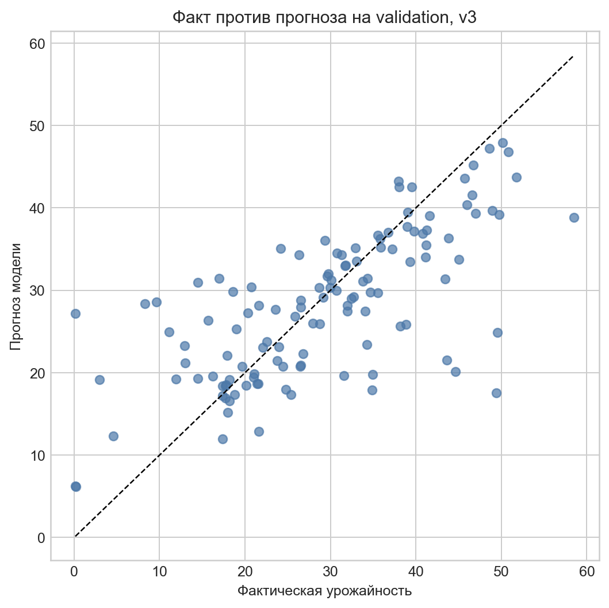
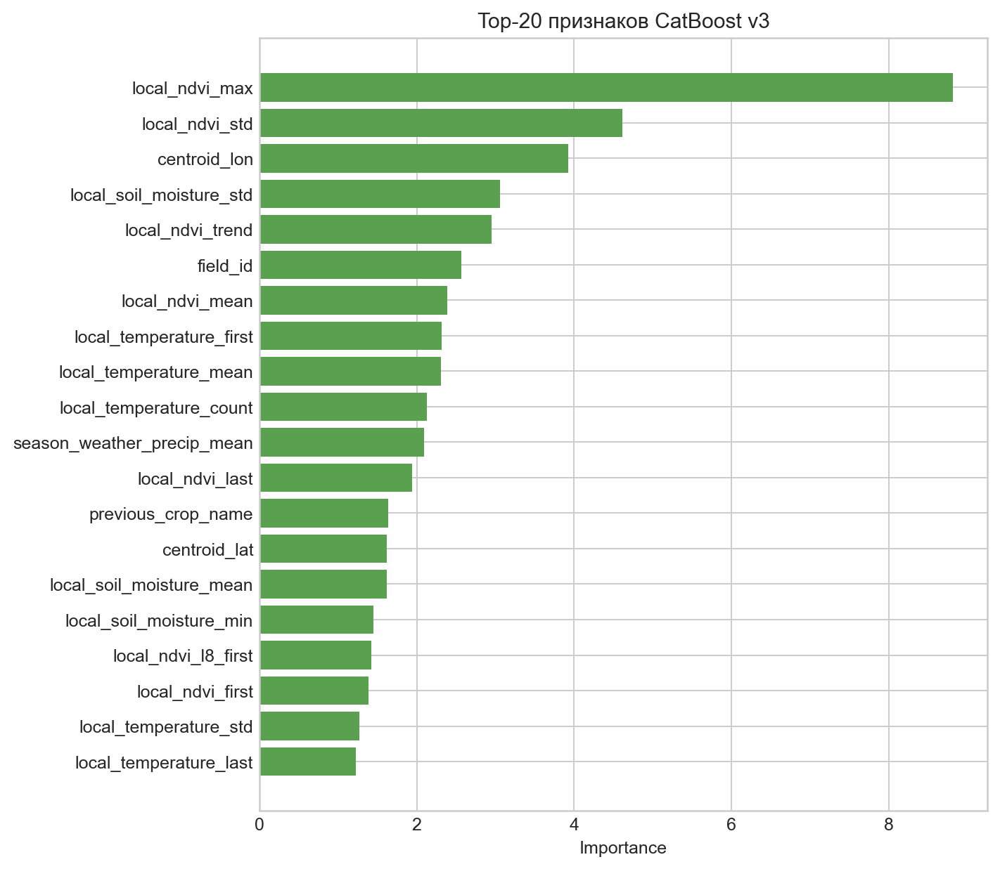

# Spring Wheat Yield Forecast

Field-level yield forecasting project for spring wheat. The repository contains a publishable enriched dataset, feature engineering code, CatBoost training pipeline, benchmark script, notebooks, and diagnostic figures.



*Validation scatter plot for the tuned CatBoost model. Points closer to the diagonal indicate more accurate field-level yield predictions.*

## Overview

The task is to predict `productivity`, a field-level yield value measured in centners per hectare. The final modeling scope is spring wheat seasons from 2020 to 2025.

The workflow combines agronomic context, season timing, vegetation indices, weather aggregates, field geometry, and historical field productivity into a tabular regression dataset. A tuned `CatBoostRegressor` is trained on `log1p(productivity)` and converted back to the original target scale for validation.

## Dataset

The repository includes the modeling dataset at `data/enriched_yield_dataset.csv`.

| File | Rows | Columns | Description |
|:---|---:|---:|:---|
| `data/enriched_yield_dataset.csv` | 609 | 115 | Enriched spring wheat field-season table used for model training and evaluation |

The private raw source table `productivity_data_v2.csv` is intentionally not included. It contains the original field-level operational records and is kept out of git. The included dataset is the cleaned modeling table produced from the raw source and external enrichment steps.

### Main columns

| Column group | Columns / examples | Meaning |
|:---|:---|:---|
| Target | `productivity` | Yield in centners per hectare |
| Field and season | `field_id`, `year`, `field_name`, `crop_name`, `previous_crop_name` | Field identity and crop rotation context |
| Calendar | `sowing_date`, `harvesting_date`, `season_duration_days` | Season start, end, and duration |
| Enrichment status | `enrich_error`, `cropwise_error`, `weather_error`, `soil_error`, `coord_source` | Diagnostics from the enrichment process |
| Vegetation indices | `local_ndvi_mean`, `local_ndvi_max`, `local_ndvi_std`, `local_ndvi_trend` and sensor-specific NDVI variants | Aggregated local time-series signals |
| Local environment | `local_temperature_*`, `local_soil_moisture_*` | Aggregated temperature and soil-moisture time series |
| Geometry | `centroid_lat`, `centroid_lon`, `field_area` | Field centroid and area from Cropwise |
| Weather | seasonal temperature, precipitation, radiation, ET0, GDD, heat/dry/frost-day aggregates | Open-Meteo Archive seasonal features |

The dataset covers 381 unique fields. All included rows are spring wheat observations.

## Feature engineering

`src/build_features.py` builds the enriched table from the private raw source CSV. It can add:

- field geometry from Cropwise;
- seasonal weather from Open-Meteo Archive;
- local time-series aggregates for NDVI, temperature, and soil moisture;
- season calendar features;
- previous-year field productivity history without future leakage.

The training script adds additional calendar features and field-history aggregates before fitting the model.

## Model

The final model is a tuned CatBoost regressor.

| Model | Target transformation | MAE | RMSE | R² |
|:---|:---|---:|---:|---:|
| CatBoost baseline | none | 6.672 | 9.604 | 0.388 |
| CatBoost improved | `log1p(productivity)` | 6.276 | 8.914 | 0.473 |
| CatBoost tuned | `log1p(productivity)` | 6.156 | 8.735 | 0.494 |

The tuned CatBoost model also outperformed the best default PyCaret benchmark on the same feature schema: RMSE 8.735 vs. 10.40.

Most influential features include local NDVI statistics, field coordinates, soil-moisture variability, local temperature aggregates, and previous crop context.



## Repository structure

```text
.
├── data/
│   └── enriched_yield_dataset.csv        # Publishable modeling dataset
├── src/
│   ├── build_features.py                 # Builds the enriched feature table
│   ├── train_catboost.py                 # Trains the final CatBoost model
│   ├── benchmark_pycaret.py              # Runs the PyCaret benchmark
│   └── plot_daily_forecast.py            # Builds daily forecast diagnostics
├── notebooks/
│   ├── eda.ipynb                         # Exploratory data analysis
│   └── modeling.ipynb                    # Modeling experiments
├── experiments/
│   ├── sequence_dataset.py               # Experimental PyTorch dataset
│   └── sequence_dataset_smoke_test.py    # Smoke test for the sequence dataset
├── figures/                              # EDA and dataset figures
├── reports/yield_model_report/figures/   # Model diagnostic figures
├── requirements.txt
└── README.md
```

## Setup

Python 3.11+ is recommended.

```bash
python -m venv .venv
source .venv/bin/activate
pip install -r requirements.txt
```

`pycaret` is only required for the benchmark script. The core CatBoost workflow does not require running PyCaret.

## Usage

### Train the CatBoost model

```bash
python src/train_catboost.py
```

Generated outputs:

- `catboost_yield_model.cbm`
- `catboost_feature_importance.csv`
- `catboost_valid_predictions.csv`

These files are reproducible model artifacts and are ignored by git.

### Run the PyCaret benchmark

```bash
python src/benchmark_pycaret.py
```

Benchmark outputs are written to `pycaret_results/`, which is ignored by git.

### Rebuild the enriched dataset

This step requires the private raw source CSV, which is not included in the repository.

```bash
python src/build_features.py \
  --input productivity_data_v2.csv \
  --output data/enriched_yield_dataset.csv \
  --output-format csv
```

Useful options:

```bash
python src/build_features.py --input productivity_data_v2.csv --output data/enriched_yield_dataset.csv --output-format csv --skip-cropwise
python src/build_features.py --input productivity_data_v2.csv --output data/enriched_yield_dataset.csv --output-format csv --skip-soil
python src/build_features.py --input productivity_data_v2.csv --output data/enriched_yield_dataset.csv --output-format csv --diagnose-cropwise
```

### Build daily forecast diagnostics

```bash
python src/plot_daily_forecast.py
```

This script uses the enriched modeling table and the private raw source table to reconstruct daily within-season trajectories. It is kept as part of the project workflow, but full reproduction requires access to the private raw data.

## Environment variables

Cropwise geometry lookup can use any of these environment variables:

- `CROPWISE_USER_API_TOKEN`
- `USER_API_TOKEN`
- `X_USER_API_TOKEN`
- `CROPWISE_TOKEN`

Example:

```bash
export CROPWISE_USER_API_TOKEN="..."
```

If no token is available, Cropwise lookup is skipped.

## Limitations

- The modeling dataset is small: 609 rows and 115 columns.
- The validation split is stratified by year, but it is not a strict GroupKFold by `field_id`.
- `field_id` is included as a feature, so part of the score may reflect known-field repeatability.
- Extreme yield values are harder to predict than the central part of the distribution.
- SoilGrids features are not included in the final table because the external API timed out during full enrichment runs.

## Next steps

- Add GroupKFold or leave-fields-out validation by `field_id`.
- Add SHAP analysis for model interpretation.
- Add prediction uncertainty intervals.
- Build phenological-window features instead of full-season aggregates only.
- Compare model quality with and without `field_id`.
